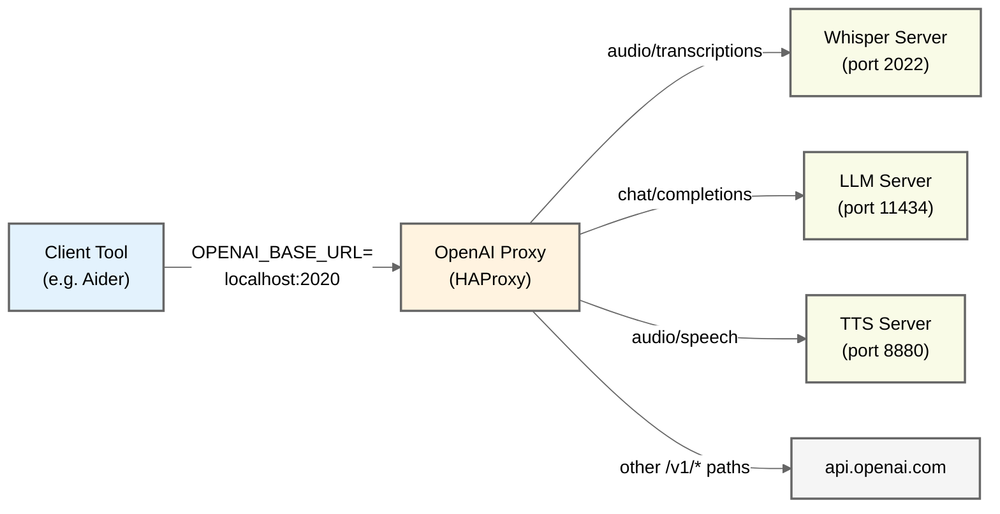

# OpenAI Proxy Architecture

This diagram shows how the OpenAI Proxy routes API requests to different backends based on the endpoint path.

## How It Works

1. **Tool Configuration**: Tools that use the OpenAI API (like Aider) check the `OPENAI_BASE_URL` environment variable
2. **Request Routing**: When set to `http://localhost:2020`, all API requests go through the OpenAI Proxy
3. **Selective Routing**: The proxy examines the request path and routes to different backends:
   - `/v1/audio/transcriptions` → Local Whisper server for voice-to-text
   - `/v1/chat/completions` → Local LLM server (e.g. Ollama)
   - `/v1/audio/speech` → Local Text-to-Speech server
   - All other `/v1/*` paths → OpenAI's API

This allows you to:
- Use local services for specific features (faster, private, cheaper)
- Fall back to OpenAI's API for everything else
- Use standard tools without modification

The proxy is transparent to the tools - they continue to work as if talking directly to OpenAI's API.
