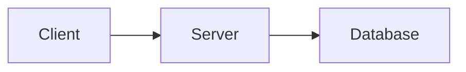

# Generating Images from Mermaid Diagrams
A guide to converting Mermaid diagrams in markdown files to high-quality SVG images using Docker or npm tools.

## Quickstart

Create an images directory and convert all Mermaid diagrams in your markdown to SVGs:

```bash
mkdir -p docs/images
podman run --rm -v $(pwd):/data:Z minlag/mermaid-cli \
    -i /data/docs/architecture.md \
    -o /data/docs/images/architecture.svg \
    -b transparent \
    -w 800 -H 600
```

Important note: The current tooling will only create one image file, even if there are multiple Mermaid diagrams in the source markdown. It will render only the first Mermaid diagram it encounters. To generate multiple images, you would need to split the diagrams into separate markdown files or use a custom script to extract and process each diagram individually.

The suggested dimensions (800x600) are optimized for GitHub README display - wide enough to be readable but not so large that they dominate the page or require scrolling on typical displays.

## Input File Format

The input markdown file can contain both text and Mermaid diagrams. The CLI will automatically find and process any Mermaid code blocks. A typical input file might look like:

```markdown
# My Architecture

Here's how the system works:



More explanation here...
```

The tool will only process the Mermaid blocks, ignoring other content.

## Quickstart with Docker

Generate an SVG from a markdown file containing Mermaid diagrams:

```bash
podman run --rm -v $(pwd):/data:Z minlag/mermaid-cli \
    -i /data/docs/architecture.md \
    -o /data/docs/images/architecture.svg \
    -b transparent
```

## Installation

```bash
# Install mermaid-cli via npm
npm install -g @mermaid-js/mermaid-cli

# Or use Podman instead
podman pull minlag/mermaid-cli
```

## Basic Usage

### Using mmdc (if installed via npm)

```bash
# Generate PNG
mmdc -i input.md -o output.png -b transparent

# Generate SVG (recommended)
mmdc -i input.md -o output.svg -b transparent

# Control size
mmdc -i input.md -o output.png -w 800 -H 600
```

### Using Podman

```bash
# Generate PNG
podman run --rm -v $(pwd):/data:Z minlag/mermaid-cli \
    -i /data/input.md \
    -o /data/output.png \
    -b transparent

# Generate SVG
podman run --rm -v $(pwd):/data:Z minlag/mermaid-cli \
    -i /data/input.md \
    -o /data/output.svg \
    -b transparent
```

## Best Practices

1. **Use SVG format** when possible:
   - Perfect scaling at any size
   - Smaller file size
   - Crisp on all displays
   - Dark/light mode friendly

2. **Set background to transparent** (`-b transparent`)
   - Works better across different themes
   - Better integration with documentation

3. **Size Guidelines**:
   - README diagrams: 800px width max
   - Documentation: 1000px width max
   - Consider target display when sizing

4. **Keep source in docs**:
   - Store Mermaid source in markdown (e.g., `docs/diagrams/`)
   - Generate images to separate directory (e.g., `docs/images/`)
   - Include both in version control

## Example Workflow

```bash
# Create directories if needed
mkdir -p docs/images

# Generate SVG from markdown containing mermaid diagram
mmdc -i docs/architecture.md \
    -o docs/images/architecture.svg \
    -b transparent \
    -w 800

# Reference in README.md
# 
```
